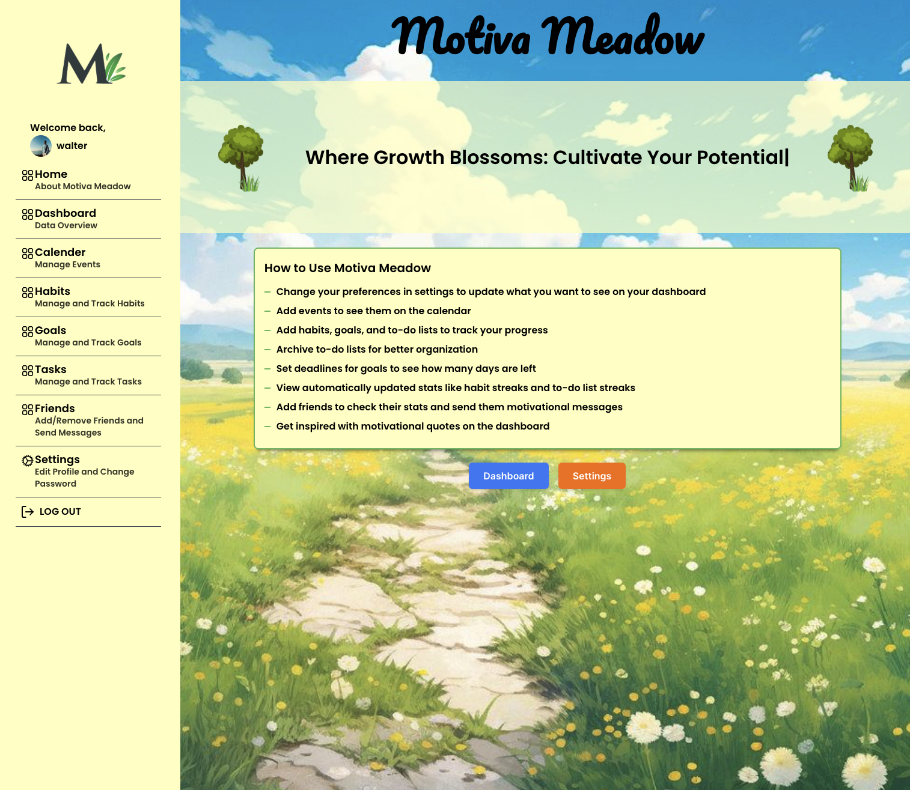

# Motiva Meadow - Your Personal Growth and Planner App

Motiva Meadow is your all-in-one personal growth and planner app, designed to help you achieve your goals, stay organized, and track your progress.

## Welcome Message

Welcome to Motiva Meadow! With Motiva Meadow, you can embark on your journey of personal growth and organization with ease. Whether you're looking to build new habits, set and achieve goals, or stay on top of your tasks and events, Motiva Meadow has got you covered.

## Overview

Motiva Meadow provides a comprehensive suite of features to support your personal growth and planning needs:

## Features

- **Habit Tracking:** Keep track of your habits and visualize your streaks to stay motivated and consistent in your routines.
  
- **Goal Management:** Set and manage your goals with deadlines, track your progress, and celebrate your achievements along the way.
  
- **Event Calendar:** Add and manage events on your calendar to stay organized and never miss an important date or appointment.
  
- **Task Lists:** Create and manage task lists to help you prioritize and stay focused on what matters most.
  
- **Friendship Features:** Connect with friends on Motiva Meadow to see their progress, send motivating messages, and even invite them to events.
  
- **Customizable Dashboard:** Customize your dashboard to get a summarized overview of your habits, tasks, events, and stats, tailored to your preferences and needs.

## Tech Stack

- **Frontend:** React.js
- **Backend:** Node.js, Express
- **Database:** MongoDB
- **Authentication:** JWT

Feel free to explore Motiva Meadow and embark on your journey towards personal growth and organization!
[Motiva Meadow](https://motiva-meadow.netlify.app 'Motiva Meadow')
